## Step 1:
Open `Xcode` project and press `Xcode` / `Preferences`

Click Accounts and find the `+` button, in the open window, scroll a bit and find `GitHub`, select it and click Continue.

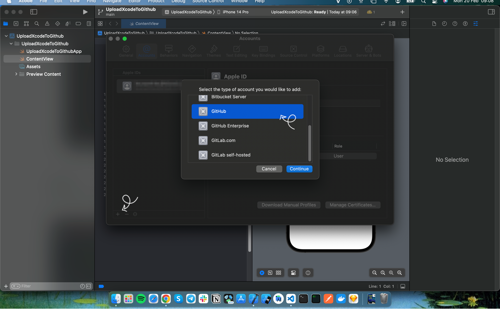

Now we can see Sign in to your GitHub account, add your GitHub name and Access Token. To find this information, visit your GitHub account.

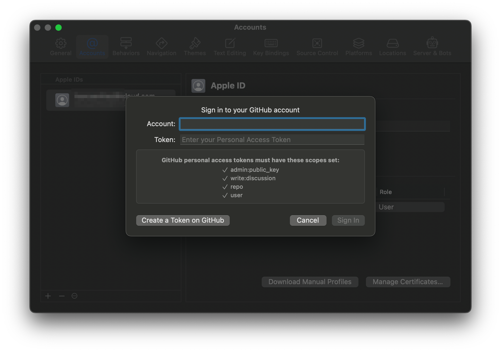

## Step 2:
Open `GitHub` account and press `Profile` / `Settings`

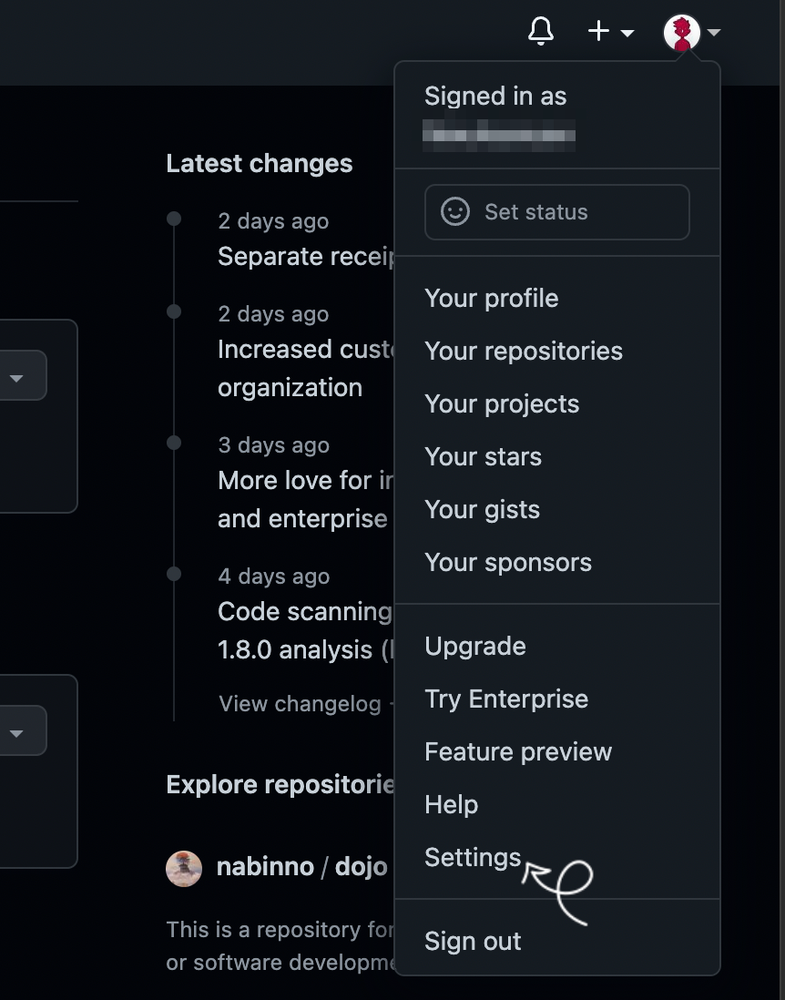

Scroll a little and select `Developer settings`

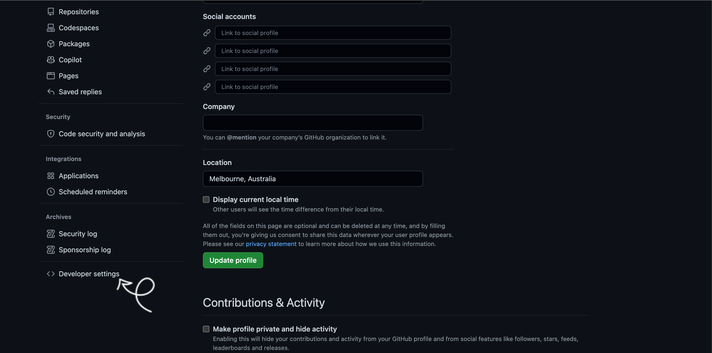

Click Personal access tokens and select Tokens (classic)

In the Confirm access window that opens, enter your password. And now you need to configure your future token. In the Expiration field, I recommend choosing No expiration. Select scopes — I select all of these. And click Generate token.

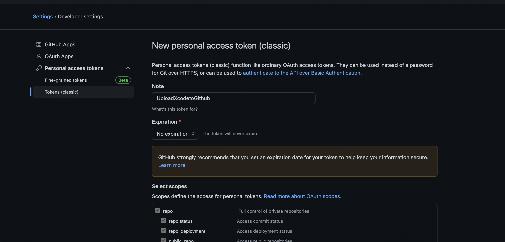

Now you can see your Personal access tokens. Just cope and save it.

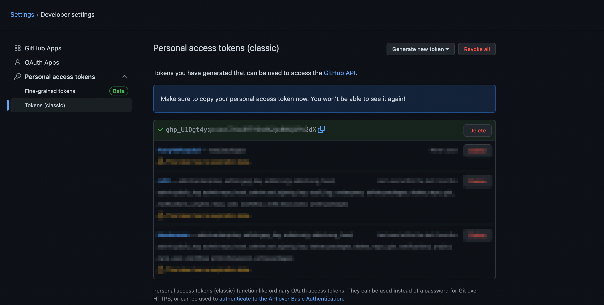

## Step 3:
We can now go back to Xcode and add all the necessary information.

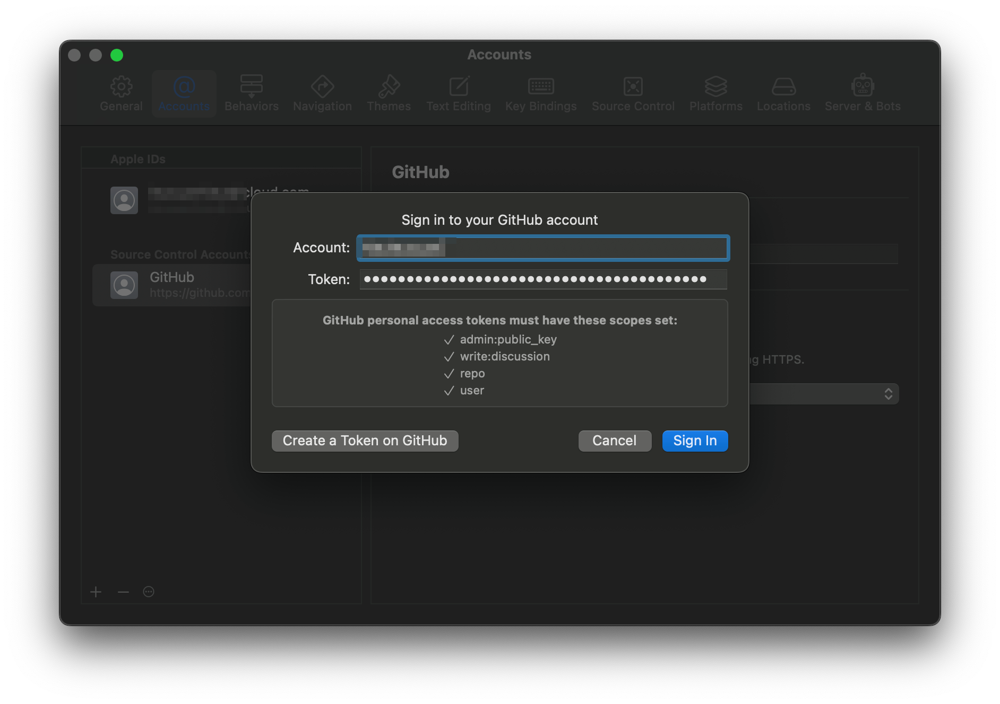

Open `Source Control` navigator, choose `Repositories`, click `Remotes` and preferred `New "Upload to GitHub" Remote…`

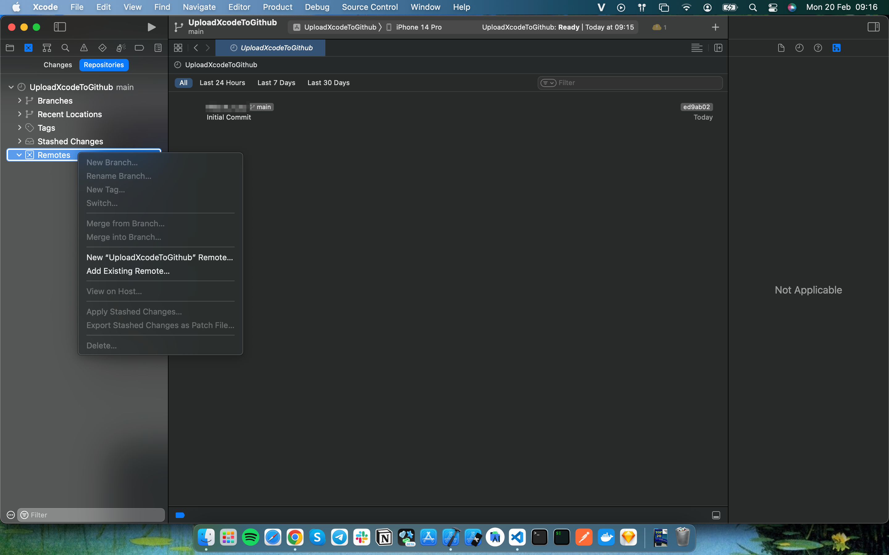

Just make a little settings to your repository.

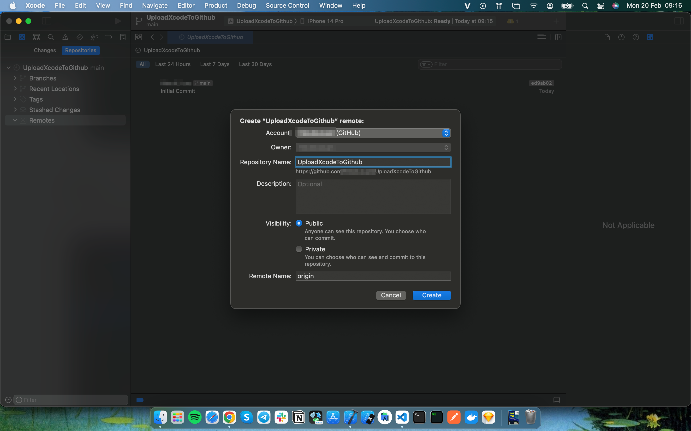

## Step 4:
And finally go to `Source Control` and click `Push`

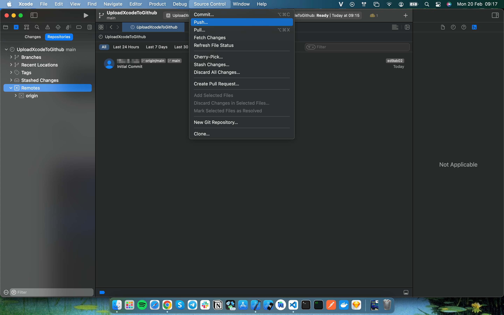

Click `Push`

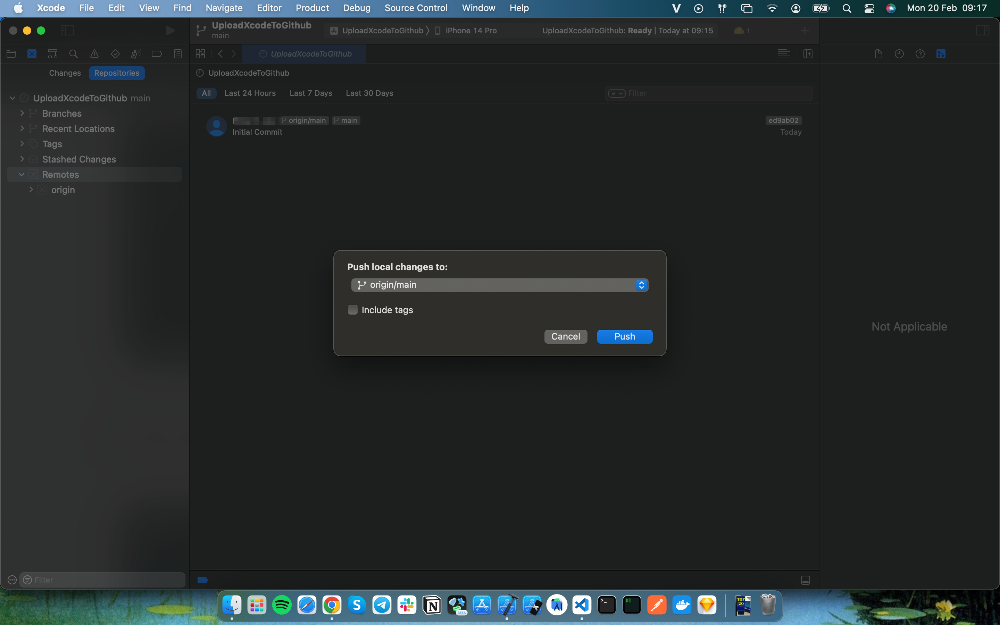

And we’re done! To make sure everything is fine, we can visit our GitHub and check if the new project is available in the Repositories.

