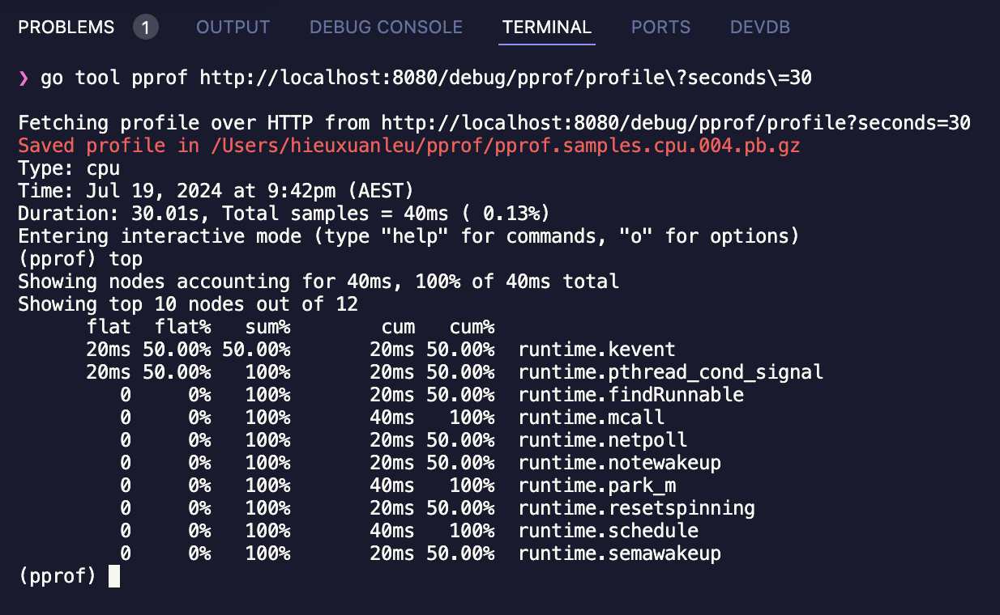
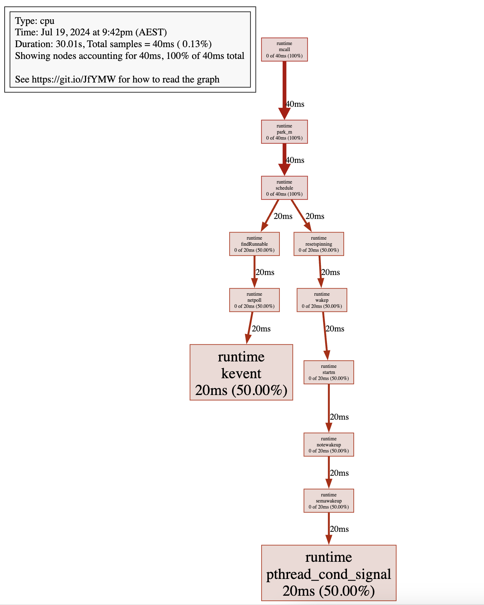
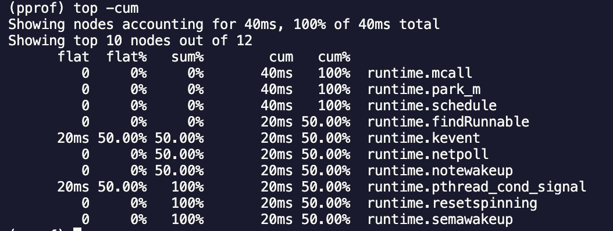
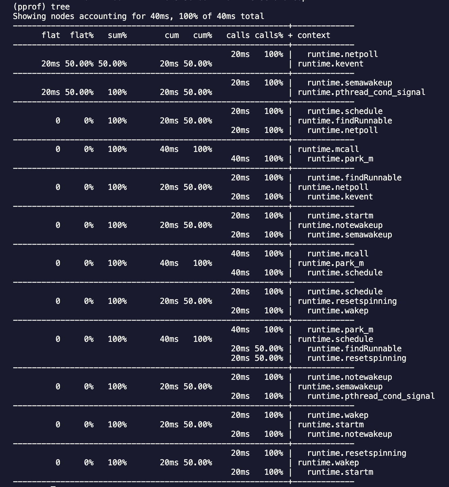
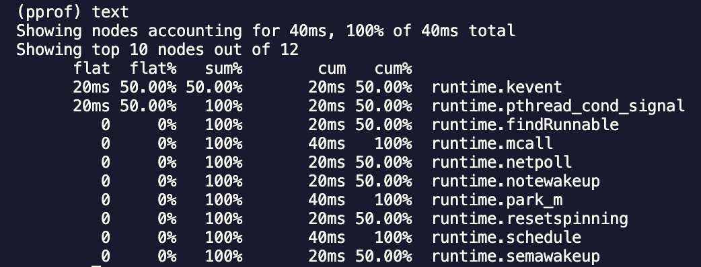

Hiệu suất là một yếu tố quan trọng đối với bất kỳ ứng dụng nào, và Golang (Go) nổi tiếng với hiệu suất cao và khả năng xử lý đồng thời mạnh mẽ. Tuy nhiên, để tận dụng tối đa tiềm năng của Go, bạn cần hiểu và áp dụng các kỹ thuật profiling và benchmarking. Trong bài viết này, chúng ta sẽ khám phá cách sử dụng các công cụ này để tối ưu hóa hiệu suất ứng dụng Go của bạn.

1. Giới thiệu Profiling và Benchmarking
Profiling là quá trình phân tích một ứng dụng để hiểu cách sử dụng tài nguyên của nó, như CPU, bộ nhớ, và I/O. Profiling giúp xác định các đoạn mã tiêu tốn nhiều tài nguyên, từ đó có thể tối ưu hóa chúng.

Benchmarking là quá trình đo lường và so sánh hiệu suất của các đoạn mã hoặc toàn bộ ứng dụng. Benchmarking giúp bạn hiểu rõ tác động của các thay đổi trong mã nguồn lên hiệu suất.

2. Profiling trong Golang
Go cung cấp một số công cụ mạnh mẽ để profiling, trong đó nổi bật nhất là gói pprof.

### Sử dụng pprof
Để sử dụng pprof, bạn cần import gói net/http/pprof và thêm một số dòng mã vào ứng dụng của mình. Dưới đây là một ví dụ chi tiết về cách thêm pprof vào ứng dụng Go.

* Bước 1: Cài đặt `pprof`


import (
    _ "net/http/pprof"
    "log"
    "net/http"
)

func main() {
    go func() {
        log.Println(http.ListenAndServe("localhost:6060", nil))
    }()
    // code
}


* Bước 2:
Giả sử bạn có một ứng dụng Go đơn giản tính toán Fibonacci như sau:


	package main

import (
    "fmt"
    "net/http"
    _ "net/http/pprof"
)

func fib(n int) int {
    if n <= 1 {
        return n
    }
    return fib(n-1) + fib(n-2)
}

func handler(w http.ResponseWriter, r *http.Request) {
    n := 35
    result := fib(n)
    fmt.Fprintf(w, "Fibonacci(%d) = %d", n, result)
}

func main() {
    http.HandleFunc("/", handler)
    fmt.Println("Server started at :8080")
    http.ListenAndServe(":8080", nil)
}



* Bước 3: Chạy ứng dụng và bắt đầu Profiling

go run main.go


Sau đó, mở trình duyệt web và truy cập http://localhost:8080 để khởi động server. Để bắt đầu profiling, truy cập http://localhost:8080/debug/pprof/.

### Phân tích kết quả Profiling
Bạn có thể sử dụng công cụ go tool pprof để phân tích kết quả profiling. Đầu tiên, bạn cần tạo một profile file:

go tool pprof http://localhost:8080/debug/pprof/profile?seconds=30


Lệnh này sẽ tạo một file profiling sau 30 giây. Tiếp theo, bạn có thể mở file profiling bằng cách:

go tool pprof [profile-file]


Một số lệnh hữu ích trong pprof bao gồm:
* top: Hiển thị các đoạn mã tiêu tốn nhiều CPU nhất.
* list `[function]`: Hiển thị mã nguồn của một hàm cụ thể và lượng CPU mà nó tiêu tốn.
* web: Hiển thị đồ thị trực quan về profiling.

Ví dụ, bạn có thể thấy kết quả `top` như sau:

Lệnh `web` tạo một biểu đồ trực quan về sử dụng tài nguyên:

4. Phân Tích Kết Quả Sâu Hơn: Lệnh `go tool pprof` cung cấp nhiều công cụ mạnh mẽ để phân tích chi tiết hơn. Bạn có thể sử dụng các lệnh sau để hiểu rõ hơn về cách ứng dụng của bạn sử dụng tài nguyên:

* top -cum: Hiển thị các hàm tiêu tốn nhiều tài nguyên nhất theo thứ tự cộng dồn.

* tree: Hiển thị biểu đồ cây về cách sử dụng tài nguyên.

* text: Hiển thị báo cáo dưới dạng văn bản.

3. Benchmarking trong Golang: Go cung cấp gói `testing` để viết các benchmark tests. Một benchmark test là một hàm bắt đầu với `Benchmark` và chấp nhận một tham số `*testing.B`.

### Viết Benchmark Tests
Dưới đây là một ví dụ về benchmark test cho hàm `fib`:

package main

import (
    "testing"
)

func BenchmarkFib(b *testing.B) {
    for i := 0; i < b.N; i++ {
        fib(30)
    }
}


Bạn có thể chạy các benchmark tests bằng lệnh:

go test -bench=.


Kết quả benchmark sẽ cho bạn biết số lần lặp lại `(N)` và thời gian trung bình mỗi lần lặp lại. Ví dụ, kết quả có thể trông như sau:

BenchmarkFib-8   	  100000	     195 ns/op


Điều này có nghĩa là hàm `fib(30)` được chạy 100,000 lần với thời gian trung bình mỗi lần là 195 nano giây.

### Ví vụ chi tiết về Benchmark 
Giả sử bạn có một hàm tính toán đơn giản:

package main

import (
    "math/rand"
    "testing"
    "time"
)

func randomArray(n int) []int {
    rand.Seed(time.Now().UnixNano())
    arr := make([]int, n)
    for i := 0; i < n; i++ {
        arr[i] = rand.Intn(1000)
    }
    return arr
}

func sortArray(arr []int) {
    for i := 0; i < len(arr); i++ {
        for j := i + 1; j < len(arr); j++ {
            if arr[i] > arr[j] {
                arr[i], arr[j] = arr[j], arr[i]
            }
        }
    }
}

func BenchmarkSortArray(b *testing.B) {
    for i := 0; i < b.N; i++ {
        arr := randomArray(1000)
        sortArray(arr)
    }
}


Chạy lệnh:

go test -bench=.


Kết quả có thể trông như sau:

BenchmarkSortArray-8   	    5000	    300000 ns/op


Kết quả benchmark sẽ cho bạn biết thời gian trung bình để sắp xếp mảng 1000 phần tử. Bạn có thể sử dụng thông tin này để tối ưu hóa hàm `sortArray`.

### Phân tích kết quả Benchmark
Kết quả benchmark sẽ cho bạn biết thời gian trung bình để thực hiện một hành động cụ thể. Bạn có thể so sánh kết quả này với các phiên bản khác của mã nguồn để xác định xem các thay đổi có cải thiện hiệu suất hay không.

### Sử dụng `benchstat`để so sánh kết quả
Công cụ `benchstat` trong gói `golang.org/x/perf/cmd/benchstat` có thể giúp bạn so sánh kết quả benchmark giữa các phiên bản khác nhau của mã nguồn. Bạn có thể cài đặt `benchstat` bằng cách:

go get -u golang.org/x/perf/cmd/benchstat


Sau đó, bạn có thể chạy benchmark và lưu kết quả vào file:

go test -bench=. > old.txt

go test -bench=. > new.txt


Sử dụng `benchstat` để so sánh kết quả:

benchstat old.txt new.txt


4. Một Số Kỹ Thuật Tối Ưu Hóa Hiệu Suất
Dưới đây là một số kỹ thuật tối ưu hóa hiệu suất trong Go:

### Sử dụng Goroutine 
Tránh tạo quá nhiều goroutine không cần thiết. Sử dụng `sync.WaitGroup` để quản lý goroutine hiệu quả.

package main

import (
    "sync"
)

func main() {
    var wg sync.WaitGroup

    for i := 0; i < 10; i++ {
        wg.Add(1)
        go func(i int) {
            defer wg.Done()
            // Công việc cần thực hiện
        }(i)
    }

    wg.Wait()
}


### Tránh sử dụng Global Variables
Sử dụng các biến cục bộ hoặc truyền biến qua hàm để tránh tranh chấp bộ nhớ.

package main

import (
    "fmt"
)

func processData(data []int) int {
    sum := 0
    for _, value := range data {
        sum += value
    }
    return sum
}

func main() {
    data := []int{1, 2, 3, 4, 5}
    fmt.Println(processData(data))
}


### Sử dụng Pool
Sử dụng `sync.Pool` để tái sử dụng các đối tượng và giảm thiểu áp lực lên bộ thu gom rác (GC).

package main

import (
    "sync"
)

var bufPool = sync.Pool{
    New: func() interface{} {
        return make([]byte, 1024)
    },
}

func main() {
    buf := bufPool.Get().([]byte)
    // Sử dụng buf
    bufPool.Put(buf)
}


5. Kết Luận
Profiling và benchmarking là các kỹ thuật quan trọng để tối ưu hóa hiệu suất ứng dụng Go. Bằng cách sử dụng các công cụ và kỹ thuật đã đề cập, bạn có thể cải thiện đáng kể hiệu suất và độ tin cậy của ứng dụng của mình. Hãy bắt đầu áp dụng chúng vào dự án của bạn ngay hôm nay!