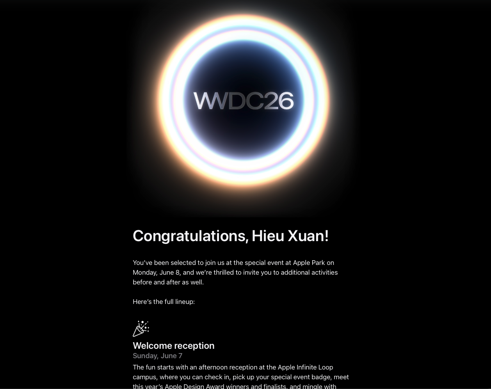

Mình vừa nhận được email mời tham dự WWDC26 tại Apple Park. 

Khi đọc xong email đó, mình đã ngồi lặng đi một lúc khá lâu.

Không phải vì đây là một sự kiện công nghệ lớn, mà bởi vì khoảnh khắc ấy khiến mình nhớ lại toàn bộ hành trình đã đi qua để theo đuổi con đường iOS Engineering.

Mình vẫn còn nhớ những ngày đầu tiên học lập trình iOS - mở Xcode lên nhưng gần như không hiểu gì về storyboard, architecture hay vòng đời của một ứng dụng. Những lần build failed liên tục, những đêm ngồi debug đến rất khuya chỉ để sửa một issue rất nhỏ, hay cảm giác áp lực khi nhận ra càng học thì càng thấy bản thân còn quá nhiều điều chưa biết.

Software engineering chưa bao giờ là một công việc dễ dàng hay hào nhoáng như nhiều người vẫn nghĩ. Phía sau một ứng dụng hoạt động ổn định là rất nhiều giờ làm việc âm thầm, rất nhiều lần xử lý production issues, rất nhiều áp lực phải liên tục học hỏi để không bị bỏ lại phía sau trong một ngành thay đổi từng ngày.

Tuy vậy, đây cũng là công việc mang lại cho mình rất nhiều cảm xúc đặc biệt.
- Đó là cảm giác khi những dòng code mình viết ra thực sự hoạt động.
- Là cảm giác khi một sản phẩm mình xây dựng có người sử dụng.
- Và cũng là cảm giác mỗi ngày bản thân đang tiến thêm một chút trên con đường mình đã lựa chọn.

Vì vậy, lời mời từ Apple ngày hôm nay, đối với mình, không chỉ đơn thuần là một tấm vé tham dự WWDC. Nó giống như một cột mốc để nhìn lại và tự nhắc bản thân rằng những nỗ lực, áp lực và sự kiên trì trong suốt thời gian qua đều hoàn toàn xứng đáng.

Từ một người bắt đầu bằng những video tutorial trên Internet, đến hôm nay có cơ hội đặt chân tới Apple Park - nơi mà trước đây mình chỉ từng thấy qua các keynote và Apple Events.

Mình biết phía trước vẫn còn rất nhiều điều phải học, rất nhiều mục tiêu cần theo đuổi và rất nhiều thử thách đang chờ đợi. Nhưng có lẽ, đây sẽ là một trong những kỷ niệm đáng nhớ nhất trong hành trình làm iOS của mình.

See you at WWDC26. 

#WWDC26 #ApplePark #iOS #Swift #SwiftUI #AppleDeveloper #SoftwareEngineer